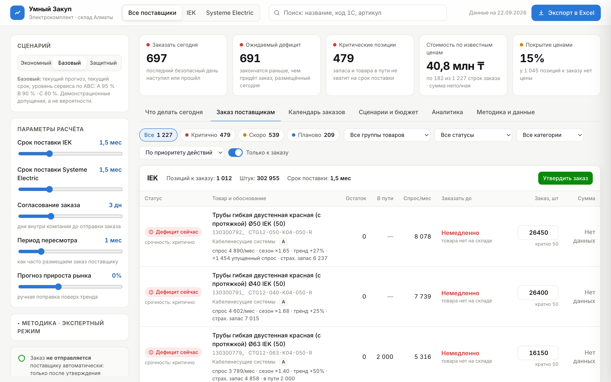
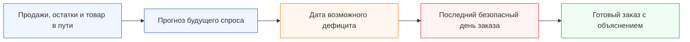
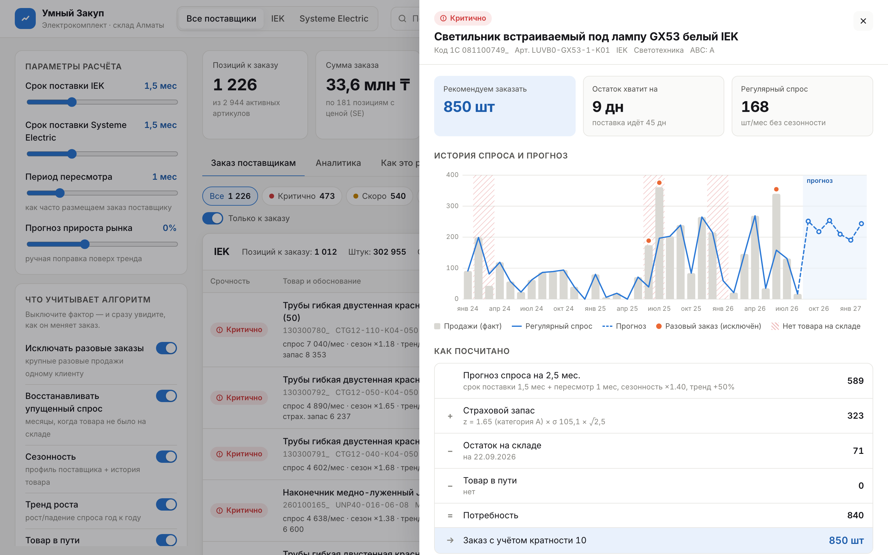

<div align="center">

# Умный Закуп

### Заказать вовремя. Не заморозить лишнее. Не потерять продажу.

**Система раннего предупреждения о дефиците и помощник менеджера по закупкам**

Заказчик: **ТОО «Электрокомплект» (ekt.kz)** · Команда: **Light** · **HACKALEM AI 2026**

[](#-что-мы-создали)
[](#-что-получает-менеджер)
[](#-безопасность)


**Поставка занимает около 45 дней. «Умный Закуп» заранее показывает, какой товар закончится, когда наступит последний безопасный день заказа и сколько нужно заказать.**

[Проблема](#-проблема) · [Последствия](#-сколько-денег-можно-потерять) · [Решение](#-что-мы-создали) · [Результат](#-какой-экономический-результат-мы-нашли) · [Запуск](#-как-запустить)

</div>

---

## 🎯 Проблема

Компания продаёт тысячи разных товаров. Чтобы понять, что пора заказать, менеджер вручную собирает несколько Excel-файлов: продажи, остатки, товар в пути, сезонность, категории и минимальные партии поставщика.

Такой расчёт занимает много времени. Поэтому его сложно делать часто и одинаково внимательно по каждому товару.

Но поставка идёт примерно **полтора месяца**. Ошибка, сделанная сегодня, становится заметна только через несколько недель — когда исправить её уже поздно.

Менеджеру приходится принимать решение сразу между двумя рисками:

| Если заказать мало или поздно | Если заказать слишком много |
|---|---|
| товар закончится до следующей поставки | деньги останутся лежать на складе |
| клиент не сможет купить нужную позицию | вырастут расходы на хранение |
| продажа и маржа будут потеряны | не хватит бюджета на действительно нужный товар |
| клиент может уйти к конкуренту | часть ассортимента может устареть |

### Почему обычного среднего недостаточно

- В одном месяце мог пройти единичный крупный заказ. Если считать его регулярным спросом, компания закупит лишнее.
- Когда товара не было на складе, продажи равны нулю. Но это не означает, что спроса не было.
- Зимой и летом один товар может продаваться по-разному.
- Часть товара уже едет от поставщика и должна уменьшать новый заказ.
- Поставщик отгружает товар только определёнными партиями.
- Пока новый заказ едет 45 дней, спрос продолжает меняться.

Главная проблема не в Excel как таковом. Проблема в том, что **бизнес слишком поздно узнаёт о будущем дефиците и слишком поздно замечает деньги, замороженные в лишнем запасе**.

## 💸 Сколько денег можно потерять

Мы проверили сервис на реальных файлах заказчика. В актуальном расчёте система нашла:

| Что обнаружено | Масштаб | Что это означает |
|---|---:|---|
| Позиций, которые рекомендуется заказать | **1 228** | такой объём невозможно качественно пересчитывать вручную каждый день |
| Критических позиций | **478** | существующего запаса может не хватить до прихода следующей поставки |
| Позиций с нулевым остатком | **414** | часть спроса уже может превращаться в упущенные продажи |
| Стоимость критической потребности по известным ценам | **не менее 14,5 млн ₸** | деньги находятся в зоне срочного решения |
| Избыточный запас по известным ценам | **около 30,2 млн ₸** | капитал лежит в товарах, запас которых превышает расчётную потребность |

> [!IMPORTANT]
> Цена заполнена только примерно у **14,8% позиций к заказу**. Поэтому 14,5 млн ₸ — не полная возможная потеря и не прогноз упущенной прибыли, а минимальная видимая сумма критической потребности. Полный денежный риск выше. Для точного расчёта потерянной прибыли нужны цены по всем товарам и их маржинальность.

Компания теряет деньги сразу в двух местах:

```text
Нет товара → нет продажи → нет выручки и прибыли

Слишком много товара → деньги заморожены → их нельзя вложить в нужные позиции
```

## 💡 Что мы создали

**«Умный Закуп»** собирает разрозненные данные в одно решение и заранее предупреждает менеджера о рисках.

Вместо вопроса:

> «Что у нас закончилось?»

сервис помогает ответить:

> **«Что закончится через несколько недель и что нужно заказать уже сегодня?»**



### Как проходит работа



Система:

1. загружает историю продаж и остатки;
2. убирает влияние единичных крупных заказов;
3. восстанавливает спрос за периоды, когда товара не было;
4. учитывает сезонность и устойчивое изменение спроса;
5. проверяет товар, который уже находится в пути;
6. прогнозирует, когда закончится текущий запас;
7. рассчитывает последний безопасный день заказа;
8. предлагает количество с учётом страхового запаса и минимальной партии;
9. объясняет рекомендацию обычными словами;
10. готовит Excel-файл для дальнейшей работы.

## ⏰ Главное отличие: сервис говорит не только «сколько», но и «когда»

Количество само по себе не спасает от дефицита. Если заказать на неделю позже, товар всё равно придёт с опозданием.

Поэтому для каждой позиции сервис строит календарь будущего остатка:

```text
Сегодня
   ↓
товар ежедневно продаётся
   ↓
учитываются запланированные приходы
   ↓
определяется возможная дата окончания запаса
   ↓
из этой даты вычитается срок поставки
   ↓
получается последний безопасный день заказа
```

Менеджер видит понятный статус:

| Статус | Значение |
|---|---|
| 🔴 Дефицит сейчас | товара уже нет, хотя ожидаемый спрос существует |
| 🔴 Просрочено | безопасная дата заказа уже прошла |
| 🟠 Сегодня | решение нужно принять сегодня |
| 🟡 На этой неделе | до безопасной даты осталось не больше семи дней |
| 🟢 Позже | запас пока позволяет отложить заказ |
| ⚪ Недостаточно данных | истории пока недостаточно для надёжного вывода |


## 🔎 Почему менеджер может доверять рекомендации

Сервис не показывает необъяснимое число. Для каждой позиции он раскрывает расчёт.

Например:

> При среднем спросе 120 штук в месяц и остатке 140 штук товар закончится примерно 28 ноября. Поставка занимает 45 дней. Заказ нужно разместить не позднее 14 октября. Потребность составляет 330 штук, а поставщик отгружает партии по 50 — поэтому рекомендуется заказать 350 штук.

В карточке товара можно увидеть:

- реальные продажи по месяцам;
- очищенный спрос без случайных всплесков;
- периоды, когда товара не было;
- сезонное изменение спроса;
- текущий остаток;
- товар в пути и ожидаемую дату прихода;
- страховой запас;
- минимальную партию поставщика;
- прогноз остатка с новым заказом и без него.



## 🧹 Как система защищает деньги от лишней закупки

Один большой заказ клиента не всегда означает, что такой же объём будет продаваться каждый месяц.

Мы сравнили два расчёта:

- обычный расчёт, который принимает все продажи за регулярный спрос;
- расчёт «Умного Закупа», который отделяет единичные крупные продажи от постоянного спроса.

Результат моделирования на предоставленных данных:

| Эффект | Результат |
|---|---:|
| Потенциально лишнее количество без очистки данных | **60 827 единиц** |
| Стоимость потенциально лишнего пополнения по известным ценам | **около 9,14 млн ₸** |

Это означает: если считать любой крупный заказ постоянным спросом, компания может направить миллионы тенге в товар, который затем будет долго лежать на складе.

## 📊 Что получает менеджер

| Было | Стало |
|---|---|
| Несколько Excel-файлов | Один экран с общей картиной |
| Ручной расчёт каждой позиции | Автоматический расчёт всего ассортимента |
| Реакция после окончания товара | Предупреждение заранее |
| Только количество заказа | Количество и крайняя дата решения |
| Непонятная итоговая цифра | Объяснение по каждой позиции |
| Риск забыть товар в пути | Приходы учитываются по датам |
| Ручная подготовка результата | Готовая выгрузка в Excel |

Менеджер может изменить предложенное количество перед выгрузкой. Система помогает принять решение, но не принимает его вместо человека.

## 💰 Какой экономический результат мы нашли

На предоставленных данных система уже выявила два отдельных финансовых резерва:

### 1. Защита от лишней закупки

Фильтрация единичных крупных продаж уменьшила модельную закупку на **60 827 единиц**. По товарам, где цена известна, это примерно **9,14 млн ₸ потенциально предотвращённой лишней закупки**.

### 2. Деньги в избыточном запасе

Сервис нашёл около **30,2 млн ₸**, находящихся в запасах сверх расчётной потребности на шесть месяцев — и это только по позициям с известной ценой.

Эти две суммы нельзя автоматически складывать: они отражают разные виды риска и могут частично пересекаться.

> **Честный вывод:** система уже нашла, где компания может не потратить лишние 9,14 млн ₸ и где около 30,2 млн ₸ капитала требует проверки и возможного высвобождения. Но это пока найденный финансовый резерв, а не деньги на банковском счёте.

Чтобы резерв превратился в реальную прибыль, компания должна:

- отменить или уменьшить ненужные заказы;
- перераспределить излишки между складами;
- продать или вернуть медленно оборачиваемый товар;
- направить высвободившийся бюджет на позиции, которые могут закончиться;
- измерить результат после пилотного периода.

После пилота экономический эффект считается просто:

```text
Реально сохранённые деньги =
предотвращённые лишние закупки
+ высвобождённый запас
+ сохранённая маржа от предотвращённого дефицита
− стоимость внедрения и хранения
```

Так мы сможем честно сказать не только «система рассчитала заказ», а:

> **«Компания сохранила X тенге и получила Y тенге дополнительной маржи благодаря тому, что нужный товар был в наличии вовремя».**

## 🧾 Какие данные используются

| Данные | Зачем они нужны |
|---|---|
| История продаж | понять реальный темп спроса |
| Остатки | определить, на сколько времени хватит товара |
| Товар в пути | не заказать повторно то, что уже едет |
| Даты ожидаемого прихода | понять, успеет ли поставка до дефицита |
| Сезонность | учитывать месяцы высокого и низкого спроса |
| Категория A/B/C | определить важность позиции и размер защиты |
| MOQ | округлить заказ до партии, которую примет поставщик |
| Цена | посчитать стоимость решения там, где цена известна |

Товары связываются между файлами по коду 1С. Персональные данные клиентов не используются.

## ✅ Что выполнено по заданию

| Требование | Что сделано |
|---|---|
| Все источники влияют на результат | продажи, остатки, товар в пути, сезонность, категория и MOQ включены в расчёт |
| Учёт сезонности и роста | прогноз меняется в зависимости от месяца и устойчивой динамики |
| Упущенный спрос | периоды отсутствия товара не принимаются за отсутствие спроса |
| Разовые крупные заказы | единичные всплески не раздувают регулярную закупку |
| Разбивка по поставщикам | рекомендации разделены между IEK и Systeme Electric |
| Объяснение каждой строки | менеджер видит причины и числа |
| Дата заказа | для товара рассчитывается последний безопасный день |
| Экспорт | согласованный заказ выгружается в Excel |
| Контроль человеком | автоматической отправки поставщику нет |

## 🔐 Безопасность

- Система ничего не отправляет поставщику автоматически.
- Менеджер проверяет и может изменить количество.
- Финальный заказ появляется только после решения человека.
- Персональные данные клиентов не используются.
- Если данных недостаточно, сервис сообщает об этом, а не придумывает результат.

## 🚀 Как развивать решение дальше

Следующие данные позволят точнее считать деньги и риски:

1. цены и маржинальность по всему ассортименту;
2. клиентские резервы и подтверждённые заказы;
3. плановые и фактические даты поставок;
4. стоимость хранения;
5. история ручных решений менеджера;
6. товары-заменители;
7. планы отдела продаж по крупным проектам.

После этого сервис сможет показывать:

- точную потерянную прибыль из-за дефицита;
- надёжность каждого поставщика;
- оптимальный заказ при ограниченном бюджете;
- варианты замены отсутствующего товара;
- фактическую экономию после внедрения;
- точность прогноза на прошлых периодах.

---

<details>
<summary><strong>Техническая информация и запуск</strong></summary>

## Как устроен расчёт

Для каждого товара система:

1. находит и исключает нетипичные единичные продажи;
2. восстанавливает ожидаемый спрос в периоды отсутствия товара;
3. учитывает сезонность и устойчивый тренд;
4. прогнозирует спрос на срок поставки и следующий цикл заказа;
5. добавляет страховой запас;
6. вычитает текущий остаток и подтверждённый товар в пути;
7. округляет результат до минимальной партии поставщика.

```text
Рекомендуемый заказ =
прогноз спроса
+ страховой запас
− текущий остаток
− подтверждённый товар в пути
```

## Технологии

- Python, pandas и NumPy — загрузка данных и расчёт;
- HTML, CSS и JavaScript — интерфейс;
- SVG — графики;
- openpyxl и SheetJS — работа с Excel;
- pytest — проверка требований и расчётов.

## Структура проекта

```text
hack-bd80e77f-light/
├── engine/                  # загрузка данных и расчёт рекомендаций
├── web/                     # пользовательский интерфейс
├── tests/                   # автоматические проверки
├── IEK/                     # данные IEK
├── Systeme electric/        # данные Systeme Electric
├── output/                  # готовые рекомендации
├── docs/                    # скриншоты
├── assets/readme/           # обложка README
└── README.md
```

## Как запустить

```bash
git clone https://github.com/BAITC-Hacks/hack-bd80e77f-light.git
cd hack-bd80e77f-light

python3 -m venv .venv
source .venv/bin/activate
pip install -r requirements.txt

python -m engine.build
python3 -m http.server 8000 --directory web
```

Откройте [http://localhost:8000](http://localhost:8000).

Проверка расчётов:

```bash
PYTHONPATH=. pytest -q
```

</details>

---

<div align="center">

### Точный заказ — это товар на полке, деньги в обороте и продажа, которую компания не потеряла.

Создано командой **Light** для **ТОО «Электрокомплект»** на **HACKALEM AI 2026**

[Техническое задание заказчика](https://docs.google.com/document/d/1Z4faOPlT1t6NMCuJSKKB8-vkZ2LVzGMR0PO9rtZgSnM/preview?tab=t.0)

</div>
