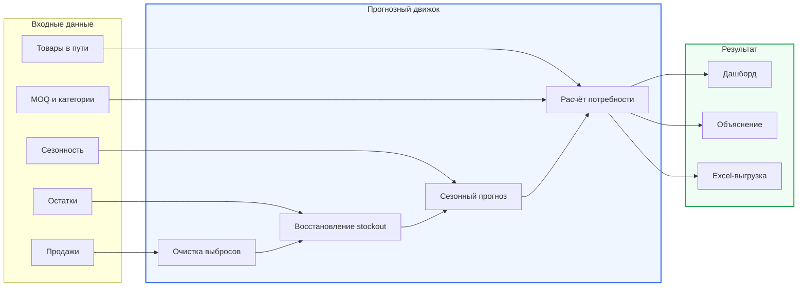

<div align="center">

# Умный Закуп

### От хаоса в Excel — к точному заказу за несколько секунд

**Автоматический расчёт заказов поставщикам для пополнения склада**

Заказчик: **ТОО «Электрокомплект» (ekt.kz)** · Команда: **Light** · **HACKALEM AI 2026**

[](https://www.python.org/)
[](#-соответствие-техническому-заданию)
[](#-что-получает-менеджер)
[](#-безопасность-и-ограничения)


**Умный Закуп** превращает историю продаж, остатки, товары в пути и сезонность в готовый список закупок — с количеством, срочностью и понятным объяснением по каждой позиции.

[Проблема](#-проблема) · [Решение](#-решение) · [Как это работает](#-как-это-работает) · [Запуск](#-быстрый-запуск) · [Методология](#-методология-расчёта) · [Техническое задание](https://docs.google.com/document/d/1Z4faOPlT1t6NMCuJSKKB8-vkZ2LVzGMR0PO9rtZgSnM/preview?tab=t.0)

</div>

---

## ✨ Главное за 30 секунд

| Было | Стало |
|---|---|
| Ручная консолидация нескольких Excel-файлов | Единый расчёт по всем источникам данных |
| Решения принимаются редко и не в реальном времени | Рекомендации пересчитываются за секунды |
| Выбросы раздувают регулярную потребность | Разовые крупные заказы автоматически исключаются |
| Нулевые продажи при отсутствии товара занижают спрос | Упущенный спрос восстанавливается |
| Непрозрачное итоговое число | Каждая рекомендация имеет объяснение |
| Риск ошибочной автоматической отправки | Финальное решение всегда остаётся за менеджером |

> **Результат:** меньше замороженных денег в избыточных запасах, меньше дефицита и упущенных продаж, быстрее и увереннее закупочные решения.

## 🎯 Проблема

Менеджер отдела закупа вручную объединяет данные из разных Excel-отчётов. Такой анализ занимает много времени, поэтому проводится нечасто. В результате:

- одни позиции закупаются с избытком и увеличивают стоимость хранения;
- другие заканчиваются раньше следующей поставки;
- единичная крупная продажа ошибочно воспринимается как устойчивый спрос;
- отсутствие товара превращается в «нулевые продажи» и занижает прогноз;
- итоговую рекомендацию сложно проверить и объяснить.

## 💡 Решение

Сервис анализирует данные партнёра и формирует готовый заказ в три действия:


Для каждого артикула менеджер видит **рекомендуемое количество**, **уровень срочности** и ответ на главный вопрос: **«Почему заказать нужно именно столько?»**

> [!IMPORTANT]
> Сервис не отправляет заказ поставщику автоматически. Менеджер проверяет рекомендации, при необходимости меняет количество и только затем экспортирует согласованный заказ.

## 📊 Что получает менеджер

| Возможность | Польза |
|---|---|
| Рекомендованный заказ по каждому SKU | Не нужно собирать формулу вручную |
| Группировка по поставщикам | Готовая структура для работы с IEK и Systeme Electric |
| Приоритет 🔴 / 🟡 / 🟢 | Сразу видно позиции с наибольшим риском дефицита |
| Объяснение расчёта | Решение можно проверить до утверждения |
| Интерактивные параметры | Можно учесть срок поставки, период пересмотра и прогноз роста |
| Аналитика спроса | Видны факт, очищенный спрос, stockout и прогноз |
| Экспорт в `.xlsx` | Результат совместим с привычным рабочим процессом |

## ⚙️ Как это работает



Расчёт использует все предоставленные источники. Если изменить остаток, товар в пути, сезонность, прогноз роста, категорию или MOQ, итоговая рекомендация тоже изменится.

## 🧠 Методология расчёта

### 1. Очистка разовых крупных заказов

Для каждого артикула алгоритм оценивает типичный размер отгрузки через устойчивые к выбросам статистики — **медиану**, **MAD** и **IQR**. Продажа считается кандидатом на разовый заказ, если она одновременно:

- превышает `медиана + 6 × MAD`;
- превышает `Q3 + 3 × IQR`;
- как минимум в 5 раз больше медианы;
- составляет не менее 25% месячных продаж артикула.

Если крупные продажи повторяются более чем в 25% активных месяцев, алгоритм считает их регулярным оптовым спросом и не исключает. Оставшиеся месячные всплески дополнительно сглаживаются фильтром Хампеля.

### 2. Восстановление упущенного спроса

Низкие продажи при нулевом остатке — не отсутствие спроса. Алгоритм определяет периоды полного или частичного **stockout** и восстанавливает ожидаемый объём по доступной истории и сезонному профилю.

### 3. Сезонность и устойчивый тренд

Прогноз учитывает сезонный профиль поставщика и, когда данных достаточно, собственную сезонность артикула. Рост оценивается год к году по очищенному спросу и ограничивается диапазоном **−30% … +50%**, чтобы случайный скачок не раздул заказ.

### 4. Страховой запас и MOQ

```text
Период покрытия = срок поставки + период пересмотра

Потребность = прогноз спроса
            + страховой запас
            − текущий остаток
            − товар в пути

Рекомендация = потребность, округлённая вверх до кратности MOQ
```

Страховой запас зависит от вариативности спроса и категории товара: для категории A используется более высокий уровень сервиса, чем для B и C.

### 5. Объяснение результата

Вместо «чёрного ящика» менеджер получает расшифровку расчёта:

> Средний спрос — 120 шт./мес. Исключён разовый заказ на 900 шт. Сезонный коэффициент — ×1,25, рост год к году — +12%. Остаток — 40 шт., в пути — 100 шт. Потребность 330 шт. округлена по MOQ до **350 шт.**

## 🚦 Логика приоритета

| Статус | Что означает | Действие |
|:---:|---|---|
| 🔴 **Критично** | Запаса и товара в пути не хватит на срок поставки | Проверить в первую очередь |
| 🟡 **Скоро** | Запаса хватит на срок поставки, но не на следующий цикл заказа | Запланировать пополнение |
| 🟢 **Планово** | Потребность положительная, срочного риска нет | Добавить в плановый заказ |

## 🗂️ Входные данные

| Источник | Что извлекается | Как влияет на расчёт |
|---|---|---|
| `Динамика продаж_*.xlsx` | Накладные, даты, SKU, количество | Поиск разовых крупных заказов |
| `Ежемесячные продажи*.xlsx` | История спроса за 2024–2026 годы | Базовый временной ряд |
| `Ежемесячные остатки*.xlsx` | Остатки по месяцам | Поиск stockout и текущая доступность |
| `Товар в пути*.xlsx` / `Путь ИЭК*.xlsx` | Количество и дата ожидаемого прихода | Вычитается из потребности |
| `Сезонность*.xlsx` | Помесячный профиль продаж | Формирует сезонный прогноз |
| `MOQ*.xlsx` | Минимальная партия / кратность | Округляет итоговый заказ |
| Категория товара | Класс A / B / C | Определяет уровень страхового запаса |

Товар связывается между источниками по **коду 1С**. Персональные данные клиентов в расчёте не используются.

## ✅ Соответствие техническому заданию

| Must have | Реализация | Автотест |
|---|---|:---:|
| Все источники влияют на результат | Остатки, путь, категории, рост, сезонность и MOQ входят в расчёт | ✅ |
| Сезонность и устойчивый рост | Сезонный индекс + ограниченный годовой тренд | ✅ |
| Компенсация упущенного спроса | Восстановление спроса в периоды stockout | ✅ |
| Защита от разовых заказов | Медиана, MAD, IQR и фильтр Хампеля | ✅ |
| Список по поставщикам с объяснением | Группировка, срочность и обоснование для каждой строки | ✅ |

Проверки требований находятся в [`tests/test_requirements.py`](tests/test_requirements.py).

## 🚀 Быстрый запуск

### Требования

- Python 3.10+
- современный браузер

### Установка и подготовка данных

```bash
git clone https://github.com/BAITC-Hacks/hack-bd80e77f-light.git
cd hack-bd80e77f-light

python3 -m venv .venv
source .venv/bin/activate
pip install -r requirements.txt

python -m engine.build
```

### Запуск интерфейса

```bash
python3 -m http.server 8000 --directory web
```

Откройте [http://localhost:8000](http://localhost:8000).

### Проверка алгоритма

```bash
PYTHONPATH=. pytest -q
```

## 🧰 Технологии

| Слой | Технологии |
|---|---|
| Аналитика и прогноз | Python, pandas, NumPy |
| Работа с Excel | openpyxl |
| Интерфейс | HTML, CSS, JavaScript |
| Графики и аналитика | Canvas / браузерная визуализация |
| Выгрузка | SheetJS, Excel `.xlsx` |
| Проверка требований | pytest |

## 📁 Структура проекта

```text
hack-bd80e77f-light/
├── engine/
│   ├── loaders.py          # загрузка и нормализация Excel-файлов
│   ├── forecast.py         # прогноз и рекомендация заказа
│   └── build.py            # сборка данных и Excel-выгрузки
├── web/                    # пользовательский интерфейс
├── tests/                  # автотесты требований ТЗ
├── IEK/                    # входные данные IEK
├── Systeme electric/       # входные данные Systeme Electric
├── output/                 # сформированные рекомендации
├── assets/readme/          # визуальные материалы README
├── requirements.txt
└── README.md
```

## 🔐 Безопасность и ограничения

- заказ **не отправляется** поставщику без подтверждения ответственного сотрудника;
- персональные и неанонимизированные данные клиентов не используются;
- каждая рекомендация объяснима и доступна для ручной проверки;
- алгоритм устойчив к аномалиям и выбросам во входных данных;
- выходной Excel сохраняет код 1С для дальнейшей работы в учётной системе.

## 🛣️ Следующие шаги

- [x] Загрузка и объединение данных поставщиков
- [x] Прогноз с сезонностью, трендом и stockout
- [x] Выявление разовых крупных заказов
- [x] Расчёт MOQ, срочности и объяснений
- [x] Экспорт рекомендаций в Excel
- [ ] Интеграция с боевой 1С
- [ ] Ролевой доступ и журнал согласований
- [ ] Мониторинг качества прогноза на новых данных

---

<div align="center">

### Light up smarter procurement ⚡

Создано командой **Light** для **ТОО «Электрокомплект»** на **HACKALEM AI 2026**

</div>
