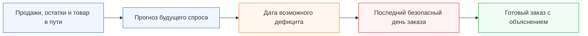
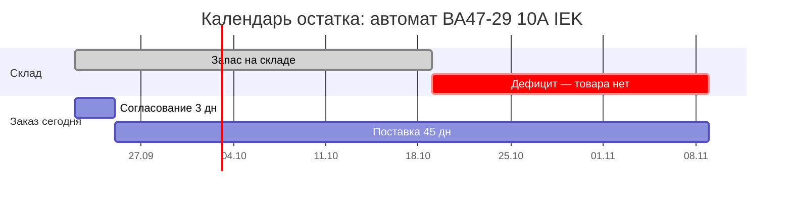
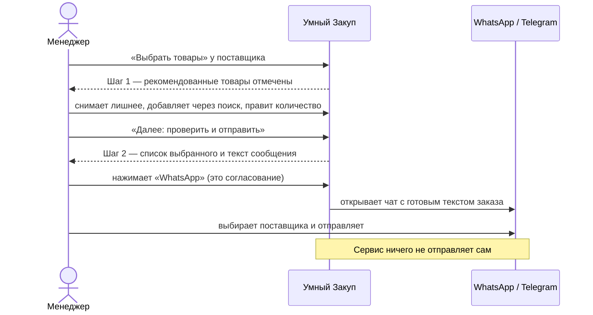
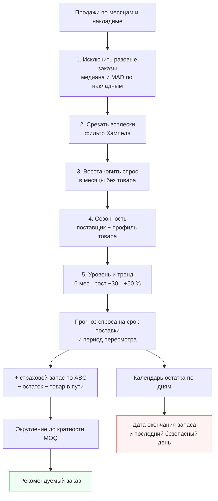
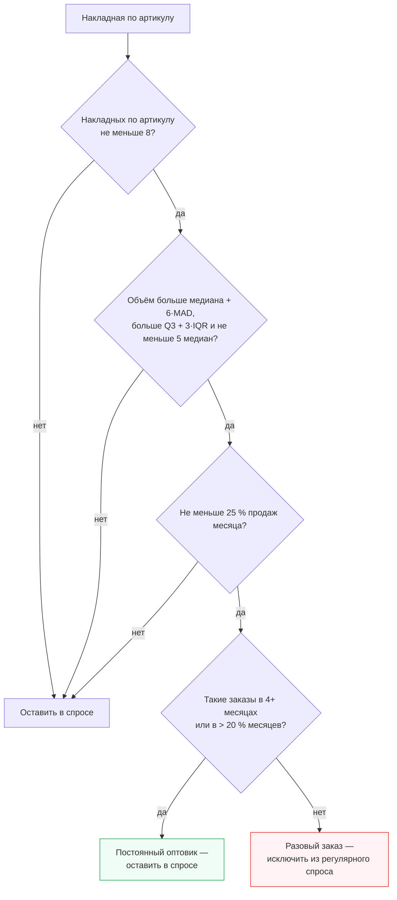

<div align="center">

<a href="https://umny-zakup.vercel.app/" target="_blank" rel="noopener noreferrer"></a>

<br>

**Поставка занимает около 45 дней. «Умный Закуп» заранее показывает, какой товар закончится, когда наступит последний безопасный день заказа и сколько нужно заказать.**

📨 **Готовый заказ поставщику — в WhatsApp, Telegram, на почту или в Excel. Какие товары покупать, менеджер выбирает сам: галочками или через поиск.** → [Как это работает](#-отправка-заказа-в-whatsapp-и-telegram)

**[🌐 Открыть сервис](https://umny-zakup.vercel.app)** · [Что решает](#-проблема) · [Как запустить](#-как-запустить) · [Технологии](#-технологии-и-архитектура) · [Как проверить](#-как-проверить-решение) · [Соответствие ТЗ](#-что-выполнено-по-заданию)

</div>

---

## 🎯 Проблема

Компания продаёт тысячи разных товаров. Чтобы понять, что пора заказать, менеджер вручную собирает несколько Excel-файлов: продажи, остатки, товар в пути, сезонность, категории и минимальные партии поставщика.

Такой расчёт занимает много времени. Поэтому его сложно делать часто и одинаково внимательно по каждому товару.

Но поставка идёт примерно **полтора месяца**. Ошибка, сделанная сегодня, становится заметна только через несколько недель — когда исправить её уже поздно.

Менеджеру приходится принимать решение сразу между двумя рисками:

| Если заказать мало или поздно | Если заказать слишком много |
|---|---|
| товар закончится до следующей поставки | деньги останутся лежать на складе |
| клиент не сможет купить нужную позицию | вырастут расходы на хранение |
| продажа и маржа будут потеряны | не хватит бюджета на действительно нужный товар |
| клиент может уйти к конкуренту | часть ассортимента может устареть |

### Почему обычного среднего недостаточно

- В одном месяце мог пройти единичный крупный заказ. Если считать его регулярным спросом, компания закупит лишнее.
- Когда товара не было на складе, продажи равны нулю. Но это не означает, что спроса не было.
- Зимой и летом один товар может продаваться по-разному.
- Часть товара уже едет от поставщика и должна уменьшать новый заказ.
- Поставщик отгружает товар только определёнными партиями.
- Пока новый заказ едет 45 дней, спрос продолжает меняться.

Главная проблема не в Excel как таковом. Проблема в том, что **бизнес слишком поздно узнаёт о будущем дефиците и слишком поздно замечает деньги, замороженные в лишнем запасе**.

## 💸 Сколько денег можно потерять

Мы проверили сервис на реальных файлах заказчика. В актуальном расчёте (базовый сценарий, данные на 22.09.2026) система нашла:

| Что обнаружено | Масштаб | Что это означает |
|---|---:|---|
| Позиций, которые рекомендуется заказать | **1 303** | такой объём невозможно качественно пересчитывать вручную каждый день |
| Заказать сегодня | **682** | последний безопасный день заказа уже наступил или прошёл |
| Ожидаемый дефицит | **708** | товар закончится раньше, чем придёт заказ, размещённый сегодня |
| Критических позиций | **534** | существующего запаса может не хватить до прихода следующей поставки |
| Позиций к заказу с нулевым остатком | **416** | часть спроса уже может превращаться в упущенные продажи |
| Стоимость критической потребности по известным ценам | **не менее 14,9 млн ₸** | деньги находятся в зоне срочного решения |
| Избыточный запас по известным ценам | **около 28,9 млн ₸** | капитал лежит в товарах, запас которых превышает расчётную потребность |

> [!IMPORTANT]
> Цена заполнена только примерно у **14,6% позиций к заказу**. Поэтому 14,9 млн ₸ — не полная возможная потеря и не прогноз упущенной прибыли, а минимальная видимая сумма критической потребности. Полный денежный риск выше. Для точного расчёта потерянной прибыли нужны цены по всем товарам и их маржинальность.

Компания теряет деньги сразу в двух местах:

```text
Нет товара → нет продажи → нет выручки и прибыли

Слишком много товара → деньги заморожены → их нельзя вложить в нужные позиции
```

## 💡 Что мы создали

**«Умный Закуп»** собирает разрозненные данные в одно решение и заранее предупреждает менеджера о рисках.

Вместо вопроса:

> «Что у нас закончилось?»

сервис помогает ответить:

> **«Что закончится через несколько недель и что нужно заказать уже сегодня?»**


Первый экран отвечает на один вопрос: **что менеджеру нужно сделать сегодня**:
- **4 показателя, которые не пересекаются:** нет на складе · срок заказа наступил · заказать на этой неделе · стоимость заказа (с долей позиций, у которых известна цена);
- **карточка каждого поставщика** — сколько позиций заказать сегодня и кнопки «Выбрать товары», WhatsApp, Telegram;
- **графики:** статусы позиций, заказы по неделям, поставщики, группы товаров;
- **10 главных действий:** просроченные и «дефицит сейчас» → ранняя дата окончания запаса → категория A → больший дефицит до прихода поставки. Отсутствие цены приоритет не снижает.

Сверху выбираются поставщик, склад и категория (группа товаров) — весь дашборд пересчитывается.

### Как проходит работа



Система:

1. загружает историю продаж и остатки;
2. убирает влияние единичных крупных заказов;
3. восстанавливает спрос за периоды, когда товара не было;
4. учитывает сезонность и устойчивое изменение спроса;
5. проверяет товар, который уже находится в пути;
6. прогнозирует, когда закончится текущий запас;
7. рассчитывает последний безопасный день заказа;
8. предлагает количество с учётом страхового запаса и минимальной партии;
9. объясняет рекомендацию обычными словами;
10. формирует заказ поставщику: менеджер выбирает товары и отправляет заказ в WhatsApp, Telegram, на почту, в Excel или CSV для 1С.

## 🚀 Как запустить

**Вариант 1 — онлайн, без установки (рекомендуем для проверки):** откройте **https://umny-zakup.vercel.app**. Работает круглосуточно на компьютере и телефоне; после первого открытия — и без интернета.

**Вариант 2 — локально, без установки:** скачайте репозиторий и откройте файл `web/index.html` в браузере. Данные уже рассчитаны, сервер не нужен.

**Вариант 3 — пересчитать на выгрузках 1С и запустить тесты** (нужны Python 3.10+ и, для сверки с браузером, Node.js 18+):

```bash
git clone https://github.com/BAITC-Hacks/hack-bd80e77f-light.git
cd hack-bd80e77f-light

python3 -m venv .venv
source .venv/bin/activate          # Windows: .venv\Scripts\activate
pip install -r requirements.txt

python -m engine.build             # чтение Excel → расчёт → web/data.js и output/*.xlsx (~30 сек)
PYTHONPATH=. pytest -q             # автотесты требований ТЗ → 32 passed
python3 -m http.server 8000 --directory web   # открыть http://localhost:8000
```

Новые выгрузки 1С кладутся в папки `IEK/` и `Systeme electric/` с теми же именами файлов; после `python -m engine.build` сервис показывает свежие данные. Онлайн-версия обновляется командой `bash scripts/deploy.sh`.

## 🛠 Технологии и архитектура

| Часть | Технологии | Зачем |
|---|---|---|
| Расчёт | **Python 3**, **pandas**, **NumPy** | чтение выгрузок 1С, очистка выбросов, stockout, сезонность, тренд, заказ, проверка на прошлом |
| Excel | **openpyxl** (Python), **SheetJS** (браузер) | чтение файлов партнёра, выгрузка заказа в Excel |
| Интерфейс | **HTML, CSS, JavaScript** без фреймворков, графики на **SVG** | быстрый статический сайт, работает с файла и офлайн |
| Пересчёт в браузере | `web/engine.js` — копия расчёта Python | мгновенный пересчёт при смене сценария, сроков, выбора товаров |
| Офлайн | **Service Worker**, Web App Manifest | работа без интернета после первого открытия |
| Хостинг | **Vercel** (статический сайт, CDN) | круглосуточная работа без сервера |
| Качество | **pytest** + **Node.js** | 32 автотеста: требования ТЗ, календарь, сценарии, сверка Python ↔ браузер |
| Мониторинг | **GitHub Actions** + `scripts/check_site.js` | проверка сайта каждые 3 часа |


## ✅ Как проверить решение

**За 2 минуты в браузере** — откройте https://umny-zakup.vercel.app:

| Шаг | Что сделать | Что должно получиться |
|---|---|---|
| 1 | Посмотреть главный экран | 4 показателя, карточки IEK и Systeme Electric, графики, 10 главных действий |
| 2 | Открыть любую строку в «10 главных действий» | Карточка товара: «Заказать N шт сегодня», дата окончания запаса, календарь остатка, вклад каждого фактора в штуках |
| 3 | «Параметры» → сценарий «Защитный» | Все цифры пересчитываются мгновенно (больше позиций к заказу) |
| 4 | Сверху выбрать категорию, например «Автоматы и защита» | Дашборд и заказ пересчитываются только по этой группе |
| 5 | Карточка Systeme Electric → «Выбрать товары» | Шаг 1: галочки, поиск, «Снять все», «+ Добавить» |
| 6 | «Далее: проверить и отправить» | Шаг 2: список выбранного и текст сообщения; кнопки WhatsApp, Telegram, Почта, Excel, «Для 1С (CSV)» |
| 7 | Вкладка «Проверить расчёт» → «+ Разовый заказ ×30» | Заказ почти не меняется — разовый заказ исключён (требование ТЗ 7.4) |
| 8 | Там же → «3 месяца без товара» | Спрос восстановлен, а не занижен (требование ТЗ 7.3) |
| 9 | Вкладка «Методика и данные» | Алгоритм, проверка прогноза на прошлом, охват данных, реестр допущений |

**Автоматически** (вариант 3 из «Как запустить»):

```bash
PYTHONPATH=. pytest -q      # ожидается: 32 passed
node scripts/check_site.js  # проверка онлайн-версии: ✅ Сайт работает
```

Тесты по требованиям ТЗ: `tests/test_requirements.py` (пять требований Must have), `tests/test_calendar.py` (безопасный день, stockout, товар в пути, сценарии, граница месяца), `tests/test_parity.py` (Python и браузер считают одинаково, цены, бюджет, экспорт), `tests/test_coverage.py` (охват данных).

## ⏰ Главное отличие: сервис говорит не только «сколько», но и «когда»

Количество само по себе не спасает от дефицита. Если заказать на неделю позже, товар всё равно придёт с опозданием.

Поэтому для каждой позиции сервис строит календарь будущего остатка:

```text
Сегодня
   ↓
товар ежедневно продаётся
   ↓
учитываются запланированные приходы
   ↓
определяется возможная дата окончания запаса
   ↓
из этой даты вычитается срок поставки и дни на согласование
   ↓
получается последний безопасный день заказа
```

```text
Последний безопасный день = дата окончания запаса − срок поставки (45 дн) − согласование (3 дн)
```

Пример из данных — автомат ВА47-29 10А IEK: запаса хватит до 19 октября, а заказ, размещённый сегодня, придёт только 9 ноября.



Последний безопасный день для этого товара был **1 сентября** — сервис показывает статус «Просрочено» и дефицит ≈ 2 225 шт до прихода заказа.

Товар в пути учитывается **только с датой прихода** и только начиная с этой даты. Товар без даты (в файле Systeme Electric) не считается прибывшим вовремя: сервис показывает его отдельно и просит уточнить дату. Спрос месяца распределяется по дням, поэтому месячный сезонный объём сохраняется и на границах месяцев.

Менеджер видит понятный статус:

| Статус | Значение |
|---|---|
| 🔴 Дефицит сейчас | товара уже нет, хотя ожидаемый спрос существует |
| 🔴 Просрочено | безопасная дата заказа уже прошла |
| 🟠 Сегодня | решение нужно принять сегодня |
| 🟡 На этой неделе | до безопасной даты осталось не больше семи дней |
| 🟢 Позже | запас пока позволяет отложить заказ |
| ⚪ Недостаточно данных | истории пока недостаточно для надёжного вывода (меньше 3 месяцев продаж) — даты не выдумываются |

Статус действий отдельный от срочности и ABC-категории: он отвечает на вопрос «когда действовать», а срочность — «насколько велик риск».


## 🔎 Почему менеджер может доверять рекомендации

Сервис не показывает необъяснимое число. Для каждой позиции он раскрывает расчёт.

Например:

> При спросе 3 185 шт./мес. и остатке 1 406 шт. (+1 800 в пути) товар закончится примерно 19 октября. Поставка 45 дн. + 3 дн. на согласование: последний безопасный день был 1 сентября (21 дн. назад) — заказывать нужно немедленно. Рекомендуется 6 072 шт.: прогноз 7 962 + страховой 1 315 − остаток 1 406 − в пути 1 800 = 6 072, округлено до кратности 12.
>
> — реальное объяснение сервиса для автомата ВА47-29 (1ф) 10А IEK

В карточке товара можно увидеть:

- реальные продажи по месяцам;
- очищенный спрос без случайных всплесков;
- периоды, когда товара не было;
- сезонное изменение спроса;
- текущий остаток;
- товар в пути и ожидаемую дату прихода;
- страховой запас;
- минимальную партию поставщика;
- прогноз остатка с новым заказом и без него;
- вклад каждого фактора в штуках: сезонность, тренд, восстановленный спрос, исключённые разовые продажи, остаток, товар в пути, страховой запас, округление до MOQ;
- качество данных по позиции: есть ли цена, кратность, достаточно ли истории.


## 📨 Отправка заказа в WhatsApp и Telegram

**Сервис умеет отправлять заказ поставщику в WhatsApp, Telegram и на почту, а также выгружать его в Excel.** Какие товары покупать, менеджер выбирает сам — отправка идёт в два понятных шага.



**Где начать:** кнопка **«Отправить заказ»** в шапке сайта или кнопки **«☑ Выбрать товары»**, **WhatsApp**, **Telegram** на карточке поставщика — все ведут в шаг 1.

### Шаг 1 из 2 — выбрать товары


- Сервис заранее отмечает товары, которые нужно заказать сегодня (можно переключить на «+ эта неделя» или «Весь заказ»).
- Галочки у каждой позиции, кнопки **«Отметить все»** и **«Снять все»** — чтобы выбрать с нуля.
- **Поиск** по названию, коду 1С или артикулу; любой товар поставщика можно добавить кнопкой **«+ Добавить»**, даже если сервис его не рекомендовал.
- Количество правится прямо в списке. Внизу всегда видно: **«Выбрано: N позиций · штук · сумма»** и кнопка **«Далее: проверить и отправить»**.

### Шаг 2 из 2 — проверить и отправить


- Список **только выбранных** товаров и **предпросмотр сообщения** — ровно тот текст, который уйдёт: поставщик, позиции и штуки, сумма и список «код — товар — количество» (до 50 позиций целиком, иначе первые 30 и ссылка на Excel).
- Кнопки **WhatsApp**, **Telegram**, **Почта** открывают мессенджер или почту с этим текстом; получателя выбирает менеджер. **Excel** скачивается только отдельной кнопкой, на телефоне **«Поделиться файлом»** отправляет его сразу.
- **«← Изменить выбор»** возвращает к шагу 1.

**Сервис ничего не отправляет сам** — как требует ТЗ: нажатие кнопки отправки и есть подтверждение ответственного сотрудника (заказ отмечается согласованным на этом устройстве). Коммерческие данные лучше отправлять с рабочего номера.

## 🧪 Проверить расчёт на своих числах

Менеджер может сам ввести продажи по месяцам, остаток, товар в пути, срок поставки, кратность и разовые заказы — и сразу увидеть заказ, дату окончания запаса, последний безопасный день, формулу и график. Расчёт тот же, что и для реальных товаров: шаги очистки, восстановления, сезонности и тренда перенесены в браузер и проверяются тестом на совпадение с Python.

- **Взять реальный товар** по коду 1С — результат совпадает с основным расчётом (сервис это показывает: «✓ Совпадает»), дальше можно менять цифры.
- **Проверить требования ТЗ одной кнопкой**: «+ разовый заказ ×30» (заказ не меняется), «3 месяца без товара» (спрос восстанавливается), «сделать сезонным», «товар в пути с датой / без даты» — с показом «было → стало».
- Все параметры (срок поставки, согласование, пересмотр, прирост) можно задать **точным числом**, а не только ползунком.

- **Добавить новый товар в заказ.** Введите название, код и поставщика — кнопка **«+ Добавить в заказ поставщику»** добавит товар в дашборд, таблицу заказа и отправку в WhatsApp / Telegram с пометкой «добавлен вручную». Удаляется одной кнопкой.

Данные ручной проверки и добавленные товары хранятся только в браузере пользователя.


## 🎚 Три сценария и бюджет

Одни и те же данные можно посчитать при разных допущениях. Переключатель сценария мгновенно пересчитывает количество, даты, риск, стоимость и график товара.

| Сценарий | Спрос | Срок поставки | Уровень сервиса A / B / C |
|---|---:|---:|---:|
| Экономный | −10% | текущий | 90% / 80% / 70% |
| Базовый | прогноз | текущий | 95% / 90% / 80% |
| Защитный | +20% | +15 дней | 98% / 95% / 90% |

Это **демонстрационные допущения**, а не вероятности; они лежат в одном месте (`engine/forecast.py → SCENARIOS`). Разница между сценариями — не «экономия»: для этого нужны проверенные маржа и стоимость хранения.


**Приоритизация заказа при ограниченном бюджете.** Если задать доступный бюджет, сервис включает позиции по приоритету: «Дефицит сейчас» и «Просрочено» → ранняя дата окончания → категория A → больший дефицит. В бюджет попадают только позиции с известной ценой. Позиции без цены не считаются бесплатными: они показаны отдельно, а критичные из них остаются в предупреждениях. В таблице видны метки «в бюджете», «не поместилось», «нет цены».

## 🔬 Проверка прогноза на прошлом

Мы «вернулись» в 1 марта 2026 года: алгоритм видел только данные до этой даты (продажи, остатки, накладные, сезонность по полным годам) и спрогнозировал спрос на март–май. Затем прогноз сравнили с фактическими продажами.

| | «Умный Закуп» | Среднее за 12 мес (как в Excel) |
|---|---:|---:|
| Ошибка прогноза (WAPE) | **23,1%** | 29,1% |
| Смещение (bias) | **+0,6%** | +16,2% (систематически завышает) |
| Категория A — WAPE | **19,4%** | 25,6% |

Простое среднее завышает спрос на 16% — это прямой путь к замороженным деньгам. Для редких товаров (категория C) ошибка выше: при штучных продажах это ожидаемо. **Проверка измеряет точность прогноза спроса и не доказывает предотвращённые дефициты** — для этого нужна точная история ежедневных остатков и поступлений.


## 🧹 Как система защищает деньги от лишней закупки

Один большой заказ клиента не всегда означает, что такой же объём будет продаваться каждый месяц.

Мы сравнили два расчёта:

- обычный расчёт, который принимает все продажи за регулярный спрос;
- расчёт «Умного Закупа», который отделяет единичные крупные продажи от постоянного спроса.

Результат моделирования на предоставленных данных:

| Эффект | Результат |
|---|---:|
| Потенциально лишнее количество без очистки данных | **49 497 единиц** |
| Стоимость потенциально лишнего пополнения по известным ценам | **около 8,35 млн ₸** |

Это означает: если считать любой крупный заказ постоянным спросом, компания может направить миллионы тенге в товар, который затем будет долго лежать на складе.

## 📊 Что получает менеджер

| Было | Стало |
|---|---|
| Несколько Excel-файлов | Один экран с общей картиной |
| Ручной расчёт каждой позиции | Автоматический расчёт всего ассортимента |
| Реакция после окончания товара | Предупреждение заранее |
| Только количество заказа | Количество и крайняя дата решения |
| Непонятная итоговая цифра | Объяснение по каждой позиции |
| Риск забыть товар в пути | Приходы учитываются по датам |
| Ручная подготовка результата | Готовая выгрузка в Excel |

Менеджер может изменить предложенное количество перед выгрузкой. Система помогает принять решение, но не принимает его вместо человека.

## 💰 Какой экономический результат мы нашли

На предоставленных данных система уже выявила два отдельных финансовых резерва:

### 1. Защита от лишней закупки

Фильтрация единичных крупных продаж уменьшила модельную закупку на **49 497 единиц**. По товарам, где цена известна, это примерно **8,35 млн ₸ модельно меньшей закупки** (по себестоимости, без учёта маржи).

### 2. Деньги в избыточном запасе

Сервис нашёл около **28,9 млн ₸**, находящихся в запасах сверх расчётной потребности на шесть месяцев — и это только по позициям с известной ценой.

Эти две суммы нельзя автоматически складывать: они отражают разные виды риска и могут частично пересекаться.

> **Честный вывод:** система уже нашла, где компания может не потратить лишние 8,35 млн ₸ и где около 28,9 млн ₸ капитала требует проверки и возможного высвобождения. Но это пока найденный финансовый резерв, а не деньги на банковском счёте.

Чтобы резерв превратился в реальную прибыль, компания должна:

- отменить или уменьшить ненужные заказы;
- перераспределить излишки между складами;
- продать или вернуть медленно оборачиваемый товар;
- направить высвободившийся бюджет на позиции, которые могут закончиться;
- измерить результат после пилотного периода.

После пилота экономический эффект считается просто:

```text
Реально сохранённые деньги =
предотвращённые лишние закупки
+ высвобождённый запас
+ сохранённая маржа от предотвращённого дефицита
− стоимость внедрения и хранения
```

Так мы сможем честно сказать не только «система рассчитала заказ», а:

> **«Компания сохранила X тенге и получила Y тенге дополнительной маржи благодаря тому, что нужный товар был в наличии вовремя».**

## 🧾 Какие данные используются

| Данные | Зачем они нужны |
|---|---|
| История продаж | понять реальный темп спроса |
| Остатки | определить, на сколько времени хватит товара |
| Товар в пути | не заказать повторно то, что уже едет |
| Даты ожидаемого прихода | понять, успеет ли поставка до дефицита |
| Сезонность | учитывать месяцы высокого и низкого спроса |
| Категория A/B/C | определить важность позиции и размер защиты |
| MOQ | округлить заказ до партии, которую примет поставщик |
| Цена | посчитать стоимость решения там, где цена известна |

Товары связываются между файлами по коду 1С. Персональные данные клиентов не используются.

## ✅ Что выполнено по заданию

Сверка с каждым пунктом технического задания ТОО «Электрокомплект».

| Пункт ТЗ | Требование | Как выполнено |
|---|---|---|
| 3 | Расчёт по складу или категории → список с обоснованием → проверка и корректировка → утверждение | Сверху выбираются поставщик, **склад** (в выгрузке один — Алматы) и **категория (группа товаров)** — весь дашборд пересчитывается. Обоснование у каждой позиции, правка количества, «Согласовать заказ» |
| 4 | История продаж, сезонность, рост, остатки, товар в пути, категории, прогноз прироста, упущенный спрос | Всё входит в расчёт — см. [Методология расчёта](#-методология-расчёта) |
| 4 | Выявлять и исключать разовые крупные заказы, включая продажи одному клиенту | Поиск по накладным — см. [Алгоритм исключения выбросов](#-алгоритм-исключения-выбросов). Поля клиента в выгрузке партнёра нет — проверка по клиенту заменена проверкой по накладной (честно указано в сервисе) |
| 5 | Выход: артикул, поставщик, количество, обоснование, срочность — таблица/дашборд с экспортом | Дашборд, таблица «Заказ поставщикам», экспорт в **Excel** и **CSV для 1С**, отправка в **WhatsApp / Telegram / почту** |
| 7.1 | Все источники влияют на результат | Тест меняет каждый источник (товар в пути, остаток, прирост, сезонность, MOQ, категория ABC) и проверяет изменение заказа |
| 7.2 | Сезонность и устойчивый рост | Прогноз повторяет сезонный профиль; тренд год к году (−30…+50 %) |
| 7.3 | Упущенный спрос при stockout | Спрос в месяцы без товара восстанавливается; потребность выше, чем по «сырым» продажам |
| 7.4 | Разовый крупный заказ не раздувает регулярное количество | Тест: заказ ×30 меняет рекомендацию меньше чем на 10 % |
| 7.5 | Список по поставщикам, объяснение каждой строки | Разбивка IEK / Systeme Electric, текстовое обоснование и таблица вклада факторов в штуках |
| 8 | Опционально: приоритет по риску дефицита | Статусы «Дефицит сейчас → Просрочено → Сегодня → Неделя», последний безопасный день заказа, календарь |
| 8 | Опционально: минимальная партия и условия поставщика | Кратность (MOQ) из файлов, срок поставки по каждому поставщику |
| 8 | Опционально: тренды спроса по категориям | Вкладка «Аналитика»: динамика спроса по группам товаров, сезонность |
| 8 | Опционально: выгрузка/рассылка заказа поставщику | WhatsApp, Telegram, почта, Excel, CSV для 1С — только после действия менеджера |
| 9 | Нельзя отправлять заказ без подтверждения сотрудника | Сервис ничего не отправляет сам: нажатие «Согласовать и отправить» — действие менеджера |
| 9 | Нельзя использовать неанонимизированные данные клиентов | Данных о клиентах в расчёте нет; номера накладных в опубликованные данные не выгружаются |
| 9 | Приватность, объяснимость, устойчивость к выбросам, совместимость с учётной системой | Поиск закрыт (`noindex`); объяснение каждой строки; медиана/MAD и фильтр Хампеля; коды 1С сохраняются как текст, CSV для загрузки в 1С |
| 10 | Репозиторий, README: методология, алгоритм исключения выбросов, инструкция запуска | Этот README: [методология](#-методология-расчёта), [алгоритм выбросов](#-алгоритм-исключения-выбросов), [запуск](#как-запустить) |

Всё это проверяют **32 автоматических теста** (`PYTHONPATH=. pytest -q`): пять требований ТЗ, календарь остатка (безопасный день, дефицит сейчас, нулевой спрос, приход до и после дефицита, товар без даты, MOQ, граница месяца), порядок сценариев, отсутствие утечки будущего в проверке прогноза, а также сверка: расчёт в браузере совпадает с эталоном на Python на 54 комбинациях. Отдельно проверяется, что отсутствующая цена не превращается в ноль, покрытие ценами считается верно, бюджетный режим не теряет критичные позиции без цены, а в Excel коды 1С сохраняются как текст и нет `NaN`/`undefined`.

## 🧭 Охват данных и допущения

На вкладке «Методика и данные» видно, **какая часть каталога дошла до расчёта** и **что взято из файлов заказчика, а что задано командой**:

| Шаг | Товаров |
|---|---:|
| Исходный каталог (коды 1С в файлах продаж и остатков) | 3 561 |
| Есть хотя бы одна продажа или остаток | 3 533 |
| Опубликовано в сервисе | 2 944 |
| В прогнозе (3+ месяцев истории, ненулевой спрос) | 2 335 |
| Рекомендовано к заказу (базовый сценарий) | 1 303 |

Исключено 617: у 28 нет ни продаж, ни остатков, ни товара в пути; 589 не продавались последние 6 месяцев и не лежат на складе — заказывать нечего.

**Реестр допущений** перечисляет 21 параметр с источником: «файл заказчика», «вычислено из истории» или «допущение команды Light». Например, срок поставки 45 дней — допущение команды (оценено по датам в файле «Путь ИЭК»), сезонность — файл заказчика плюс профиль товара.

В Excel-выгрузке есть лист **«Параметры»**: дата данных, сценарий, сроки поставки, факторы расчёта, покрытие ценами и отметка «поставщику ничего не отправлено».

Как перейти от демо к пилоту (вход по ролям, данные через API, журнал согласований, интеграция с 1С) — в [docs/PILOT_ARCHITECTURE.md](docs/PILOT_ARCHITECTURE.md).

## 🔐 Безопасность

- Система ничего не отправляет поставщику автоматически.
- Менеджер проверяет и может изменить количество.
- «Отметить согласованным» сохраняет отметку только на этом устройстве — это не журнал согласований; Excel подготовлен для проверки и последующего импорта в учётную систему.
- Номера накладных в опубликованных данных не хранятся. В выгрузке партнёра нет поля клиента, поэтому проверка «крупные продажи одному клиенту» невозможна — разовые заказы ищутся по накладной.
- Финальный заказ появляется только после решения человека.
- Персональные данные клиентов не используются.
- Если данных недостаточно, сервис сообщает об этом, а не придумывает результат.
- Отсутствующая цена показывается как «Нет данных», а не 0 ₸; стоимость заказа всегда подписана как неполная, если цены известны не везде.
- В выгрузке каждая строка помечена «Черновик, не отправлен» или «Утверждён, не отправлен поставщику».

## 🚀 Как развивать решение дальше

Следующие данные позволят точнее считать деньги и риски:

1. цены и маржинальность по всему ассортименту;
2. клиентские резервы и подтверждённые заказы;
3. плановые и фактические даты поставок;
4. стоимость хранения;
5. история ручных решений менеджера;
6. товары-заменители;
7. планы отдела продаж по крупным проектам.

После этого сервис сможет показывать:

- точную потерянную прибыль из-за дефицита;
- надёжность каждого поставщика (интерфейс уже готов и ждёт плановые и фактические даты приходов);
- бюджетный режим по всему ассортименту, а не только по позициям с ценой;
- варианты замены отсутствующего товара;
- фактическую экономию после внедрения;
- уведомления в Telegram о наступлении безопасной даты заказа.

---

## 🧮 Методология расчёта



Расчёт идёт по каждому артикулу. Все параметры собраны в начале [`engine/forecast.py`](engine/forecast.py).

1. **Очистка от разовых заказов и всплесков** — см. [алгоритм ниже](#-алгоритм-исключения-выбросов).
2. **Восстановление упущенного спроса (stockout).** Остаток известен на начало каждого месяца, конец месяца = начало следующего. Доля месяца в наличии: оба нуля → ≈ 10 % (или 40 %, если продажи всё же были), один ноль → 60 %, иначе 100 %. Спрос в таком месяце = `max(факт, min(ожидаемый, факт + (1 − доля) × ожидаемый))`, где ожидаемый считается только по месяцам с товаром.
3. **Сезонность.** Коэффициенты поставщика из файла «Сезонность» + собственный профиль товара по полным годам (вес до 60 %).
4. **Уровень и тренд.** Уровень — средний спрос за 6 последних месяцев без сезонности. Тренд — последние 6 месяцев к тем же месяцам год назад, ограничен −30…+50 %. Прогноз прироста рынка — ручная поправка менеджера.
5. **Страховой запас** `= z × σ × √(срок поставки + период пересмотра)`; z по категории ABC (частота заказов за 12 мес.): A — 95 %, B — 90 %, C — 80 % уровня сервиса.
6. **Заказ** `= прогноз на (срок поставки + пересмотр) + страховой запас − остаток − товар в пути с датой прихода`, округление вверх до кратности (MOQ).
7. **Календарь остатка и срочность.** Остаток по дням на 180 дней (месячный прогноз распределён по дням, приходы товара в пути — по датам). **Последний безопасный день = дата окончания запаса − срок поставки − согласование.** Статусы: Дефицит сейчас · Просрочено · Сегодня · На этой неделе · Позже · Недостаточно данных (меньше 3 мес. истории).

## 🧹 Алгоритм исключения выбросов

Цель — чтобы разовая крупная продажа не превратилась в регулярную закупку. Два слоя:



**1. Разовые заказы по накладным.** Для каждого артикула по всем расходным накладным считаются устойчивые к выбросам статистики — **медиана** и **MAD** (медианное абсолютное отклонение) размера отгрузки. Накладная признаётся разовым крупным заказом, если **одновременно**:
- объём > медиана + 6 × MAD **и** > Q3 + 3 × IQR;
- объём ≥ 5 медиан;
- накладная даёт ≥ 25 % продаж артикула за месяц;
- по артикулу не меньше 8 накладных (иначе «обычный» заказ не определить).

Такие накладные **вычитаются** из регулярного спроса и показываются в карточке товара. **Защита от ложных срабатываний:** если крупные заказы повторяются (в 4+ месяцах или в > 20 % месяцев продаж), это постоянный оптовый покупатель — такой спрос регулярный и не исключается.

**2. Фильтр Хампеля по месячному ряду** (для периода без накладных и всплесков без документа). Окно ±3 месяца; значение выше `медиана + 3 × 1,4826 × MAD` и выше 2 медиан **срезается до границы**, а не удаляется. Месяцы без товара в «норму» окна не входят — иначе обычные продажи после дефицита ошибочно считались бы всплеском.

**Клиент.** В ТЗ — «включая крупные продажи одному клиенту». В выгрузке партнёра поля клиента нет (дата, документ, товар, склад, количество), поэтому разовый заказ определяется по накладной. При появлении обезличенного ID клиента правило расширяется на серию накладных одного клиента.

**Проверка:** тест добавляет заказ в 30 раз больше месячного спроса — рекомендация меняется меньше чем на 10 %, а без фильтра выросла бы более чем в 2 раза. Тест на постоянного оптовика подтверждает, что регулярные крупные покупки не удаляются.

<details>
<summary><strong>Техническая информация: формулы и структура проекта</strong></summary>

## Как устроен расчёт

Для каждого товара система:

1. находит и исключает нетипичные единичные продажи;
2. восстанавливает ожидаемый спрос в периоды отсутствия товара;
3. учитывает сезонность и устойчивый тренд;
4. прогнозирует спрос на срок поставки и следующий цикл заказа;
5. добавляет страховой запас;
6. вычитает текущий остаток и подтверждённый товар в пути;
7. округляет результат до минимальной партии поставщика.

```text
Рекомендуемый заказ = прогноз спроса на (срок поставки + период пересмотра)
                    + страховой запас (z по ABC и сценарию × σ × √горизонт)
                    − текущий остаток
                    − подтверждённый товар в пути (с датой прихода)
                    → округление вверх до кратности поставщика

Последний безопасный день = дата окончания запаса − срок поставки − согласование
```

Одна и та же функция расчёта есть в Python (`engine/forecast.py → plan`) и в браузере (`web/engine.js → plan`); тест `tests/test_parity.py` проверяет, что они дают одинаковый результат. Проверка прогноза на прошлом — `engine/backtest.py`.

## Структура проекта

```text
hack-bd80e77f-light/
├── engine/
│   ├── loaders.py          # чтение и нормализация выгрузок 1С
│   ├── forecast.py         # алгоритм: выбросы, stockout, сезонность, тренд, заказ, календарь
│   ├── backtest.py         # проверка прогноза на прошлом
│   ├── coverage.py         # охват каталога и причины исключения
│   └── build.py            # сборка web/data.js и Excel
├── web/                    # сайт: index.html, app.js, engine.js, styles.css, data.js, sw.js
├── tests/                  # 32 автотеста (pytest + сверка с браузером через Node.js)
├── scripts/                # deploy.sh — публикация, check_site.js — проверка сайта
├── docs/                   # скриншоты, PILOT_ARCHITECTURE.md — план пилота
├── IEK/, Systeme electric/ # данные партнёра
├── output/                 # Excel с рекомендациями
├── assets/readme/          # оформление README
├── requirements.txt, vercel.json
└── README.md
```

</details>

---

<div align="center">

### Точный заказ — это товар на полке, деньги в обороте и продажа, которую компания не потеряла.

## 🌐 [Открыть сервис: umny-zakup.vercel.app](https://umny-zakup.vercel.app)

Создано командой **Light** для **ТОО «Электрокомплект»** на **HACKALEM AI 2026**

[Техническое задание заказчика](https://docs.google.com/document/d/1Z4faOPlT1t6NMCuJSKKB8-vkZ2LVzGMR0PO9rtZgSnM/preview?tab=t.0)

</div>
