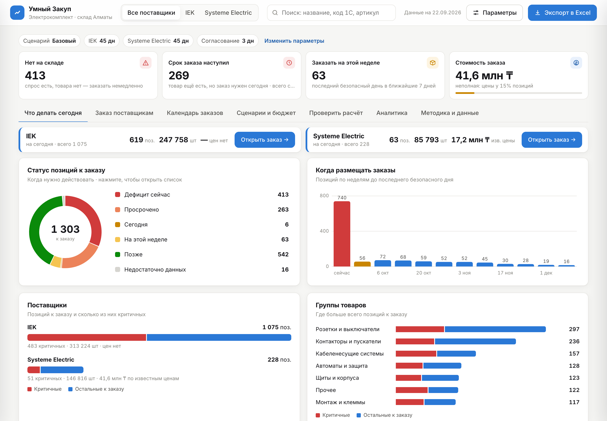
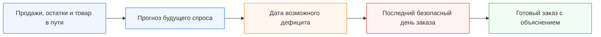
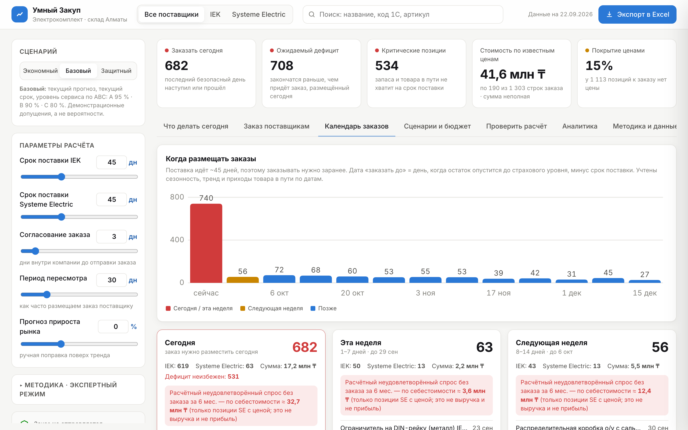
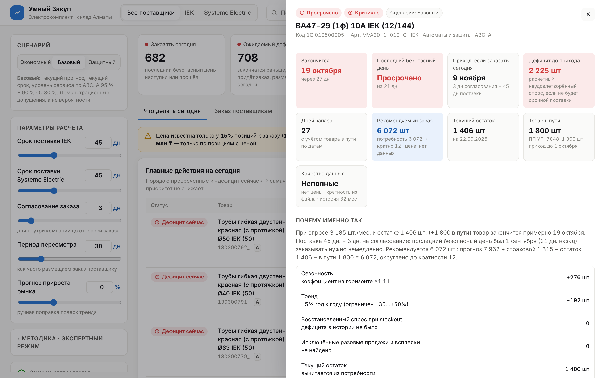
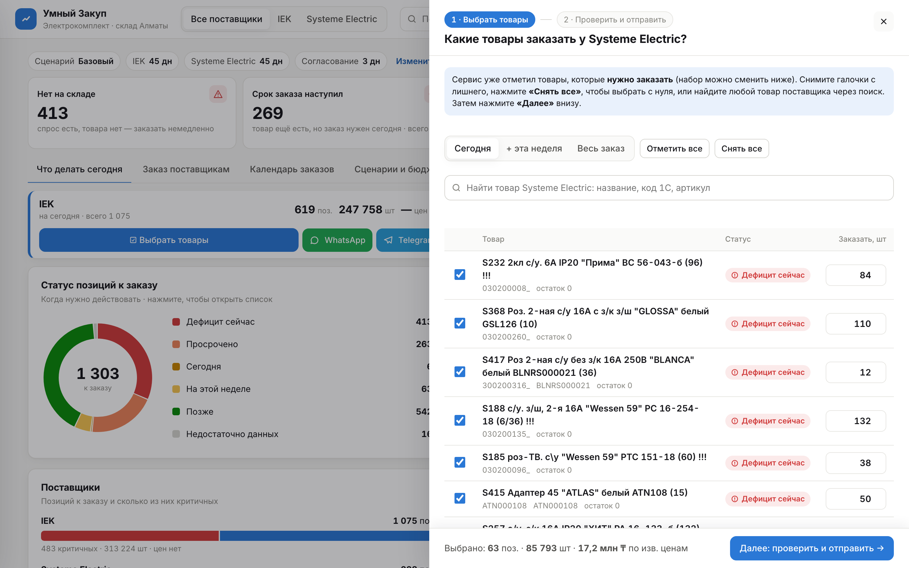
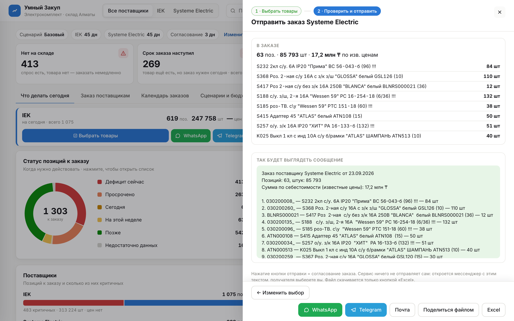
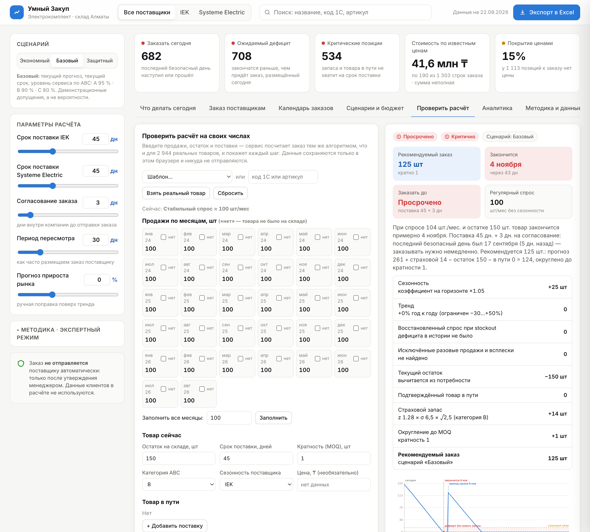
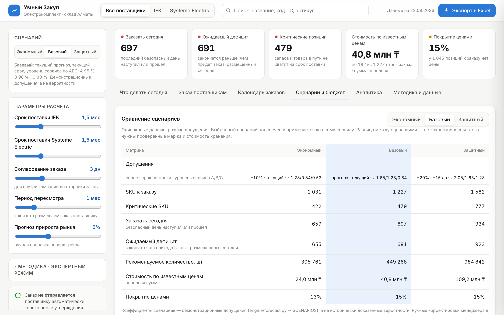
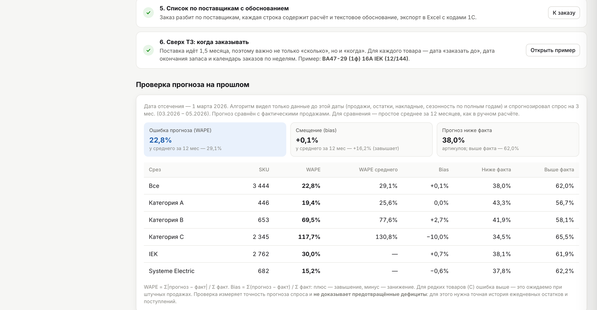

<div align="center">


<br>

<a href="https://umny-zakup.vercel.app/" target="_blank" rel="noopener noreferrer"></a>

<br>

**Поставка занимает около 45 дней. «Умный Закуп» заранее показывает, какой товар закончится, когда наступит последний безопасный день заказа и сколько нужно заказать.**

📨 **Готовый заказ поставщику — в WhatsApp, Telegram, на почту или в Excel. Какие товары покупать, менеджер выбирает сам: галочками или через поиск.** → [Как это работает](#-отправка-заказа-в-whatsapp-и-telegram)

[Проблема](#-проблема) · [Последствия](#-сколько-денег-можно-потерять) · [Решение](#-что-мы-создали) · [Результат](#-какой-экономический-результат-мы-нашли) · [Запуск](#-как-запустить)

</div>

---

## 🎯 Проблема

Компания продаёт тысячи разных товаров. Чтобы понять, что пора заказать, менеджер вручную собирает несколько Excel-файлов: продажи, остатки, товар в пути, сезонность, категории и минимальные партии поставщика.

Такой расчёт занимает много времени. Поэтому его сложно делать часто и одинаково внимательно по каждому товару.

Но поставка идёт примерно **полтора месяца**. Ошибка, сделанная сегодня, становится заметна только через несколько недель — когда исправить её уже поздно.

Менеджеру приходится принимать решение сразу между двумя рисками:

| Если заказать мало или поздно | Если заказать слишком много |
|---|---|
| товар закончится до следующей поставки | деньги останутся лежать на складе |
| клиент не сможет купить нужную позицию | вырастут расходы на хранение |
| продажа и маржа будут потеряны | не хватит бюджета на действительно нужный товар |
| клиент может уйти к конкуренту | часть ассортимента может устареть |

### Почему обычного среднего недостаточно

- В одном месяце мог пройти единичный крупный заказ. Если считать его регулярным спросом, компания закупит лишнее.
- Когда товара не было на складе, продажи равны нулю. Но это не означает, что спроса не было.
- Зимой и летом один товар может продаваться по-разному.
- Часть товара уже едет от поставщика и должна уменьшать новый заказ.
- Поставщик отгружает товар только определёнными партиями.
- Пока новый заказ едет 45 дней, спрос продолжает меняться.

Главная проблема не в Excel как таковом. Проблема в том, что **бизнес слишком поздно узнаёт о будущем дефиците и слишком поздно замечает деньги, замороженные в лишнем запасе**.

## 💸 Сколько денег можно потерять

Мы проверили сервис на реальных файлах заказчика. В актуальном расчёте (базовый сценарий, данные на 22.09.2026) система нашла:

| Что обнаружено | Масштаб | Что это означает |
|---|---:|---|
| Позиций, которые рекомендуется заказать | **1 303** | такой объём невозможно качественно пересчитывать вручную каждый день |
| Заказать сегодня | **682** | последний безопасный день заказа уже наступил или прошёл |
| Ожидаемый дефицит | **708** | товар закончится раньше, чем придёт заказ, размещённый сегодня |
| Критических позиций | **534** | существующего запаса может не хватить до прихода следующей поставки |
| Позиций к заказу с нулевым остатком | **416** | часть спроса уже может превращаться в упущенные продажи |
| Стоимость критической потребности по известным ценам | **не менее 14,9 млн ₸** | деньги находятся в зоне срочного решения |
| Избыточный запас по известным ценам | **около 28,9 млн ₸** | капитал лежит в товарах, запас которых превышает расчётную потребность |

> [!IMPORTANT]
> Цена заполнена только примерно у **14,6% позиций к заказу**. Поэтому 14,9 млн ₸ — не полная возможная потеря и не прогноз упущенной прибыли, а минимальная видимая сумма критической потребности. Полный денежный риск выше. Для точного расчёта потерянной прибыли нужны цены по всем товарам и их маржинальность.

Компания теряет деньги сразу в двух местах:

```text
Нет товара → нет продажи → нет выручки и прибыли

Слишком много товара → деньги заморожены → их нельзя вложить в нужные позиции
```

## 💡 Что мы создали

**«Умный Закуп»** собирает разрозненные данные в одно решение и заранее предупреждает менеджера о рисках.

Вместо вопроса:

> «Что у нас закончилось?»

сервис помогает ответить:

> **«Что закончится через несколько недель и что нужно заказать уже сегодня?»**



Первый экран отвечает на один вопрос: **что менеджеру нужно сделать сегодня**. Пять показателей — заказать сегодня, ожидаемый дефицит, критические позиции, стоимость по известным ценам, покрытие ценами — и десять самых важных действий: просроченные и «дефицит сейчас» → самая ранняя дата окончания запаса → категория A → больший дефицит до прихода поставки. Отсутствие цены приоритет не снижает.

### Как проходит работа



Система:

1. загружает историю продаж и остатки;
2. убирает влияние единичных крупных заказов;
3. восстанавливает спрос за периоды, когда товара не было;
4. учитывает сезонность и устойчивое изменение спроса;
5. проверяет товар, который уже находится в пути;
6. прогнозирует, когда закончится текущий запас;
7. рассчитывает последний безопасный день заказа;
8. предлагает количество с учётом страхового запаса и минимальной партии;
9. объясняет рекомендацию обычными словами;
10. готовит Excel-файл для дальнейшей работы.

## ⏰ Главное отличие: сервис говорит не только «сколько», но и «когда»

Количество само по себе не спасает от дефицита. Если заказать на неделю позже, товар всё равно придёт с опозданием.

Поэтому для каждой позиции сервис строит календарь будущего остатка:

```text
Сегодня
   ↓
товар ежедневно продаётся
   ↓
учитываются запланированные приходы
   ↓
определяется возможная дата окончания запаса
   ↓
из этой даты вычитается срок поставки и дни на согласование
   ↓
получается последний безопасный день заказа
```

```text
Последний безопасный день = дата окончания запаса − срок поставки (45 дн) − согласование (3 дн)
```

Товар в пути учитывается **только с датой прихода** и только начиная с этой даты. Товар без даты (в файле Systeme Electric) не считается прибывшим вовремя: сервис показывает его отдельно и просит уточнить дату. Спрос месяца распределяется по дням, поэтому месячный сезонный объём сохраняется и на границах месяцев.

Менеджер видит понятный статус:

| Статус | Значение |
|---|---|
| 🔴 Дефицит сейчас | товара уже нет, хотя ожидаемый спрос существует |
| 🔴 Просрочено | безопасная дата заказа уже прошла |
| 🟠 Сегодня | решение нужно принять сегодня |
| 🟡 На этой неделе | до безопасной даты осталось не больше семи дней |
| 🟢 Позже | запас пока позволяет отложить заказ |
| ⚪ Недостаточно данных | истории пока недостаточно для надёжного вывода (меньше 3 месяцев продаж) — даты не выдумываются |

Статус действий отдельный от срочности и ABC-категории: он отвечает на вопрос «когда действовать», а срочность — «насколько велик риск».



## 🔎 Почему менеджер может доверять рекомендации

Сервис не показывает необъяснимое число. Для каждой позиции он раскрывает расчёт.

Например:

> При спросе 3 185 шт./мес. и остатке 1 406 шт. (+1 800 в пути) товар закончится примерно 19 октября. Поставка 45 дн. + 3 дн. на согласование: последний безопасный день был 1 сентября (21 дн. назад) — заказывать нужно немедленно. Рекомендуется 6 072 шт.: прогноз 7 962 + страховой 1 315 − остаток 1 406 − в пути 1 800 = 6 072, округлено до кратности 12.
>
> — реальное объяснение сервиса для автомата ВА47-29 (1ф) 10А IEK

В карточке товара можно увидеть:

- реальные продажи по месяцам;
- очищенный спрос без случайных всплесков;
- периоды, когда товара не было;
- сезонное изменение спроса;
- текущий остаток;
- товар в пути и ожидаемую дату прихода;
- страховой запас;
- минимальную партию поставщика;
- прогноз остатка с новым заказом и без него;
- вклад каждого фактора в штуках: сезонность, тренд, восстановленный спрос, исключённые разовые продажи, остаток, товар в пути, страховой запас, округление до MOQ;
- качество данных по позиции: есть ли цена, кратность, достаточно ли истории.



## 📨 Отправка заказа в WhatsApp и Telegram

**Сервис умеет отправлять заказ поставщику в WhatsApp, Telegram и на почту, а также выгружать его в Excel.** Какие товары покупать, менеджер выбирает сам — отправка идёт в два понятных шага.

**Где начать:** кнопка **«Отправить заказ»** в шапке сайта или кнопки **«☑ Выбрать товары»**, **WhatsApp**, **Telegram** на карточке поставщика — все ведут в шаг 1.

### Шаг 1 из 2 — выбрать товары



- Сервис заранее отмечает товары, которые нужно заказать сегодня (можно переключить на «+ эта неделя» или «Весь заказ»).
- Галочки у каждой позиции, кнопки **«Отметить все»** и **«Снять все»** — чтобы выбрать с нуля.
- **Поиск** по названию, коду 1С или артикулу; любой товар поставщика можно добавить кнопкой **«+ Добавить»**, даже если сервис его не рекомендовал.
- Количество правится прямо в списке. Внизу всегда видно: **«Выбрано: N позиций · штук · сумма»** и кнопка **«Далее: проверить и отправить»**.

### Шаг 2 из 2 — проверить и отправить



- Список **только выбранных** товаров и **предпросмотр сообщения** — ровно тот текст, который уйдёт: поставщик, позиции и штуки, сумма и список «код — товар — количество» (до 50 позиций целиком, иначе первые 30 и ссылка на Excel).
- Кнопки **WhatsApp**, **Telegram**, **Почта** открывают мессенджер или почту с этим текстом; получателя выбирает менеджер. **Excel** скачивается только отдельной кнопкой, на телефоне **«Поделиться файлом»** отправляет его сразу.
- **«← Изменить выбор»** возвращает к шагу 1.

**Сервис ничего не отправляет сам** — как требует ТЗ: нажатие кнопки отправки и есть подтверждение ответственного сотрудника (заказ отмечается согласованным на этом устройстве). Коммерческие данные лучше отправлять с рабочего номера.

## 🧪 Проверить расчёт на своих числах

Менеджер может сам ввести продажи по месяцам, остаток, товар в пути, срок поставки, кратность и разовые заказы — и сразу увидеть заказ, дату окончания запаса, последний безопасный день, формулу и график. Расчёт тот же, что и для реальных товаров: шаги очистки, восстановления, сезонности и тренда перенесены в браузер и проверяются тестом на совпадение с Python.

- **Взять реальный товар** по коду 1С — результат совпадает с основным расчётом (сервис это показывает: «✓ Совпадает»), дальше можно менять цифры.
- **Проверить требования ТЗ одной кнопкой**: «+ разовый заказ ×30» (заказ не меняется), «3 месяца без товара» (спрос восстанавливается), «сделать сезонным», «товар в пути с датой / без даты» — с показом «было → стало».
- Все параметры (срок поставки, согласование, пересмотр, прирост) можно задать **точным числом**, а не только ползунком.

Данные ручной проверки хранятся только в браузере пользователя.



## 🎚 Три сценария и бюджет

Одни и те же данные можно посчитать при разных допущениях. Переключатель сценария мгновенно пересчитывает количество, даты, риск, стоимость и график товара.

| Сценарий | Спрос | Срок поставки | Уровень сервиса A / B / C |
|---|---:|---:|---:|
| Экономный | −10% | текущий | 90% / 80% / 70% |
| Базовый | прогноз | текущий | 95% / 90% / 80% |
| Защитный | +20% | +15 дней | 98% / 95% / 90% |

Это **демонстрационные допущения**, а не вероятности; они лежат в одном месте (`engine/forecast.py → SCENARIOS`). Разница между сценариями — не «экономия»: для этого нужны проверенные маржа и стоимость хранения.



**Приоритизация заказа при ограниченном бюджете.** Если задать доступный бюджет, сервис включает позиции по приоритету: «Дефицит сейчас» и «Просрочено» → ранняя дата окончания → категория A → больший дефицит. В бюджет попадают только позиции с известной ценой. Позиции без цены не считаются бесплатными: они показаны отдельно, а критичные из них остаются в предупреждениях. В таблице видны метки «в бюджете», «не поместилось», «нет цены».

## 🔬 Проверка прогноза на прошлом

Мы «вернулись» в 1 марта 2026 года: алгоритм видел только данные до этой даты (продажи, остатки, накладные, сезонность по полным годам) и спрогнозировал спрос на март–май. Затем прогноз сравнили с фактическими продажами.

| | «Умный Закуп» | Среднее за 12 мес (как в Excel) |
|---|---:|---:|
| Ошибка прогноза (WAPE) | **23,1%** | 29,1% |
| Смещение (bias) | **+0,6%** | +16,2% (систематически завышает) |
| Категория A — WAPE | **19,4%** | 25,6% |

Простое среднее завышает спрос на 16% — это прямой путь к замороженным деньгам. Для редких товаров (категория C) ошибка выше: при штучных продажах это ожидаемо. **Проверка измеряет точность прогноза спроса и не доказывает предотвращённые дефициты** — для этого нужна точная история ежедневных остатков и поступлений.



## 🧹 Как система защищает деньги от лишней закупки

Один большой заказ клиента не всегда означает, что такой же объём будет продаваться каждый месяц.

Мы сравнили два расчёта:

- обычный расчёт, который принимает все продажи за регулярный спрос;
- расчёт «Умного Закупа», который отделяет единичные крупные продажи от постоянного спроса.

Результат моделирования на предоставленных данных:

| Эффект | Результат |
|---|---:|
| Потенциально лишнее количество без очистки данных | **49 497 единиц** |
| Стоимость потенциально лишнего пополнения по известным ценам | **около 8,35 млн ₸** |

Это означает: если считать любой крупный заказ постоянным спросом, компания может направить миллионы тенге в товар, который затем будет долго лежать на складе.

## 📊 Что получает менеджер

| Было | Стало |
|---|---|
| Несколько Excel-файлов | Один экран с общей картиной |
| Ручной расчёт каждой позиции | Автоматический расчёт всего ассортимента |
| Реакция после окончания товара | Предупреждение заранее |
| Только количество заказа | Количество и крайняя дата решения |
| Непонятная итоговая цифра | Объяснение по каждой позиции |
| Риск забыть товар в пути | Приходы учитываются по датам |
| Ручная подготовка результата | Готовая выгрузка в Excel |

Менеджер может изменить предложенное количество перед выгрузкой. Система помогает принять решение, но не принимает его вместо человека.

## 💰 Какой экономический результат мы нашли

На предоставленных данных система уже выявила два отдельных финансовых резерва:

### 1. Защита от лишней закупки

Фильтрация единичных крупных продаж уменьшила модельную закупку на **49 497 единиц**. По товарам, где цена известна, это примерно **8,35 млн ₸ модельно меньшей закупки** (по себестоимости, без учёта маржи).

### 2. Деньги в избыточном запасе

Сервис нашёл около **28,9 млн ₸**, находящихся в запасах сверх расчётной потребности на шесть месяцев — и это только по позициям с известной ценой.

Эти две суммы нельзя автоматически складывать: они отражают разные виды риска и могут частично пересекаться.

> **Честный вывод:** система уже нашла, где компания может не потратить лишние 8,35 млн ₸ и где около 28,9 млн ₸ капитала требует проверки и возможного высвобождения. Но это пока найденный финансовый резерв, а не деньги на банковском счёте.

Чтобы резерв превратился в реальную прибыль, компания должна:

- отменить или уменьшить ненужные заказы;
- перераспределить излишки между складами;
- продать или вернуть медленно оборачиваемый товар;
- направить высвободившийся бюджет на позиции, которые могут закончиться;
- измерить результат после пилотного периода.

После пилота экономический эффект считается просто:

```text
Реально сохранённые деньги =
предотвращённые лишние закупки
+ высвобождённый запас
+ сохранённая маржа от предотвращённого дефицита
− стоимость внедрения и хранения
```

Так мы сможем честно сказать не только «система рассчитала заказ», а:

> **«Компания сохранила X тенге и получила Y тенге дополнительной маржи благодаря тому, что нужный товар был в наличии вовремя».**

## 🧾 Какие данные используются

| Данные | Зачем они нужны |
|---|---|
| История продаж | понять реальный темп спроса |
| Остатки | определить, на сколько времени хватит товара |
| Товар в пути | не заказать повторно то, что уже едет |
| Даты ожидаемого прихода | понять, успеет ли поставка до дефицита |
| Сезонность | учитывать месяцы высокого и низкого спроса |
| Категория A/B/C | определить важность позиции и размер защиты |
| MOQ | округлить заказ до партии, которую примет поставщик |
| Цена | посчитать стоимость решения там, где цена известна |

Товары связываются между файлами по коду 1С. Персональные данные клиентов не используются.

## ✅ Что выполнено по заданию

| Требование | Что сделано |
|---|---|
| Все источники влияют на результат | продажи, остатки, товар в пути, сезонность, категория и MOQ включены в расчёт |
| Учёт сезонности и роста | прогноз меняется в зависимости от месяца и устойчивой динамики |
| Упущенный спрос | периоды отсутствия товара не принимаются за отсутствие спроса |
| Разовые крупные заказы | единичные всплески не раздувают регулярную закупку |
| Разбивка по поставщикам | рекомендации разделены между IEK и Systeme Electric |
| Объяснение каждой строки | менеджер видит причины и числа |
| Дата заказа | для товара рассчитывается последний безопасный день |
| Экспорт | согласованный заказ выгружается в Excel |
| Контроль человеком | автоматической отправки поставщику нет |
| Сверх ТЗ | сценарии, бюджетный режим, качество данных, проверка прогноза на прошлом |

Всё это проверяют **30 автоматических тестов** (`PYTHONPATH=. pytest -q`): пять требований ТЗ, календарь остатка (безопасный день, дефицит сейчас, нулевой спрос, приход до и после дефицита, товар без даты, MOQ, граница месяца), порядок сценариев, отсутствие утечки будущего в проверке прогноза, а также сверка: расчёт в браузере совпадает с эталоном на Python на 54 комбинациях. Отдельно проверяется, что отсутствующая цена не превращается в ноль, покрытие ценами считается верно, бюджетный режим не теряет критичные позиции без цены, а в Excel коды 1С сохраняются как текст и нет `NaN`/`undefined`.

## 🧭 Охват данных и допущения

На вкладке «Методика и данные» видно, **какая часть каталога дошла до расчёта** и **что взято из файлов заказчика, а что задано командой**:

| Шаг | Товаров |
|---|---:|
| Исходный каталог (коды 1С в файлах продаж и остатков) | 3 561 |
| Есть хотя бы одна продажа или остаток | 3 533 |
| Опубликовано в сервисе | 2 944 |
| В прогнозе (3+ месяцев истории, ненулевой спрос) | 2 335 |
| Рекомендовано к заказу (базовый сценарий) | 1 303 |

Исключено 617: у 28 нет ни продаж, ни остатков, ни товара в пути; 589 не продавались последние 6 месяцев и не лежат на складе — заказывать нечего.

**Реестр допущений** перечисляет 21 параметр с источником: «файл заказчика», «вычислено из истории» или «допущение команды Light». Например, срок поставки 45 дней — допущение команды (оценено по датам в файле «Путь ИЭК»), сезонность — файл заказчика плюс профиль товара.

В Excel-выгрузке есть лист **«Параметры»**: дата данных, сценарий, сроки поставки, факторы расчёта, покрытие ценами и отметка «поставщику ничего не отправлено».

Как перейти от демо к пилоту (вход по ролям, данные через API, журнал согласований, интеграция с 1С) — в [docs/PILOT_ARCHITECTURE.md](docs/PILOT_ARCHITECTURE.md).

## 🔐 Безопасность

- Система ничего не отправляет поставщику автоматически.
- Менеджер проверяет и может изменить количество.
- «Отметить согласованным» сохраняет отметку только на этом устройстве — это не журнал согласований; Excel подготовлен для проверки и последующего импорта в учётную систему.
- Номера накладных в опубликованных данных не хранятся. В выгрузке партнёра нет поля клиента, поэтому проверка «крупные продажи одному клиенту» невозможна — разовые заказы ищутся по накладной.
- Финальный заказ появляется только после решения человека.
- Персональные данные клиентов не используются.
- Если данных недостаточно, сервис сообщает об этом, а не придумывает результат.
- Отсутствующая цена показывается как «Нет данных», а не 0 ₸; стоимость заказа всегда подписана как неполная, если цены известны не везде.
- В выгрузке каждая строка помечена «Черновик, не отправлен» или «Утверждён, не отправлен поставщику».

## 🚀 Как развивать решение дальше

Следующие данные позволят точнее считать деньги и риски:

1. цены и маржинальность по всему ассортименту;
2. клиентские резервы и подтверждённые заказы;
3. плановые и фактические даты поставок;
4. стоимость хранения;
5. история ручных решений менеджера;
6. товары-заменители;
7. планы отдела продаж по крупным проектам.

После этого сервис сможет показывать:

- точную потерянную прибыль из-за дефицита;
- надёжность каждого поставщика (интерфейс уже готов и ждёт плановые и фактические даты приходов);
- бюджетный режим по всему ассортименту, а не только по позициям с ценой;
- варианты замены отсутствующего товара;
- фактическую экономию после внедрения;
- уведомления в Telegram о наступлении безопасной даты заказа.

---

<details>
<summary><strong>Техническая информация и запуск</strong></summary>

## Как устроен расчёт

Для каждого товара система:

1. находит и исключает нетипичные единичные продажи;
2. восстанавливает ожидаемый спрос в периоды отсутствия товара;
3. учитывает сезонность и устойчивый тренд;
4. прогнозирует спрос на срок поставки и следующий цикл заказа;
5. добавляет страховой запас;
6. вычитает текущий остаток и подтверждённый товар в пути;
7. округляет результат до минимальной партии поставщика.

```text
Рекомендуемый заказ = прогноз спроса на (срок поставки + период пересмотра)
                    + страховой запас (z по ABC и сценарию × σ × √горизонт)
                    − текущий остаток
                    − подтверждённый товар в пути (с датой прихода)
                    → округление вверх до кратности поставщика

Последний безопасный день = дата окончания запаса − срок поставки − согласование
```

Одна и та же функция расчёта есть в Python (`engine/forecast.py → plan`) и в браузере (`web/engine.js → plan`); тест `tests/test_parity.py` проверяет, что они дают одинаковый результат. Проверка прогноза на прошлом — `engine/backtest.py`.

## Технологии

- Python, pandas и NumPy — загрузка данных и расчёт;
- HTML, CSS и JavaScript — интерфейс;
- SVG — графики;
- openpyxl и SheetJS — работа с Excel;
- pytest — проверка требований и расчётов.

## Структура проекта

```text
hack-bd80e77f-light/
├── engine/                  # загрузка данных и расчёт рекомендаций
├── web/                     # пользовательский интерфейс
├── tests/                   # автоматические проверки
├── IEK/                     # данные IEK
├── Systeme electric/        # данные Systeme Electric
├── output/                  # готовые рекомендации
├── docs/                    # скриншоты
├── assets/readme/           # обложка README
└── README.md
```

## Как запустить

Онлайн-версия: **https://umny-zakup.vercel.app** — статический сайт на Vercel (CDN), работает круглосуточно и не зависит от компьютера разработчика. Поисковая индексация отключена (`noindex`), так как в сервисе коммерческие данные партнёра.

- **Без интернета.** При первом открытии браузер сохраняет все файлы сервиса (Service Worker). Дальше сервис открывается и считает офлайн; когда сеть есть, всегда загружается свежая версия. В шапке появляется метка «Офлайн».
- **Мониторинг.** Каждые 3 часа GitHub Actions на серверах GitHub запускает `scripts/check_site.js`: доступность всех файлов, заголовок `noindex`, загрузка данных и расчёт по всем 2 944 артикулам без `NaN`. При сбое команде приходит письмо. Проверку можно запустить и вручную: `node scripts/check_site.js`.

Локально — открыть `web/index.html` в браузере: данные уже собраны, сервер не нужен.

Пересчитать на новых выгрузках 1С и запустить локально:

```bash
git clone https://github.com/BAITC-Hacks/hack-bd80e77f-light.git
cd hack-bd80e77f-light

python3 -m venv .venv
source .venv/bin/activate
pip install -r requirements.txt

python -m engine.build
python3 -m http.server 8000 --directory web
```

Откройте [http://localhost:8000](http://localhost:8000).

Проверка расчётов (нужен Node.js для сверки с браузером, иначе эти тесты пропускаются):

```bash
PYTHONPATH=. pytest -q      # 30 passed
```

Обновить онлайн-версию после пересчёта данных:

```bash
bash scripts/deploy.sh      # публикует папку web/ на Vercel и сразу проверяет сайт
```

</details>

---

<div align="center">

### Точный заказ — это товар на полке, деньги в обороте и продажа, которую компания не потеряла.

## 🌐 [Открыть сервис: umny-zakup.vercel.app](https://umny-zakup.vercel.app)

Создано командой **Light** для **ТОО «Электрокомплект»** на **HACKALEM AI 2026**

[Техническое задание заказчика](https://docs.google.com/document/d/1Z4faOPlT1t6NMCuJSKKB8-vkZ2LVzGMR0PO9rtZgSnM/preview?tab=t.0)

</div>
